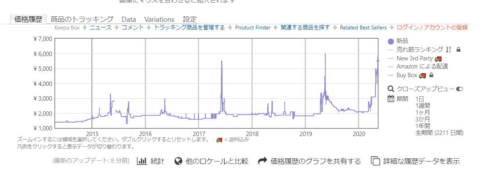

# 5分でLambda Storeをつかってみた




Free

Database名、regionを適当に。（test, US-EAST-1\(N. Virginia\)としました\)



ポップアップ（だいあろぐ）が表示されたと思います。ここでは、nodeを選んでみました。

じぶんのpcで動作確認

```text
# nodeをdockerで起動
docker run -it --rm node bash

# redisをinstall
yarn add redis

# nodeを起動
node

# redisをrequire
redis = require('redis')

# Lamda Storeのサンプルの通り
var client = redis.createClient ({
  host : 'us1-excited-dog-30334.lambda.store',
  port : '30334',
  password: 'xxxxxxxxxxxxxxxxxxxxxxxxxxxxxxxx'
  });
client.on("error", function(err) {
  throw err;
  });
client.set('foo','bar');

# 試しにget
client.get('foo', (e,r)=>console.log(r))
```

めっちゃ楽

消去も簡単


このデータベースは消去済みです

